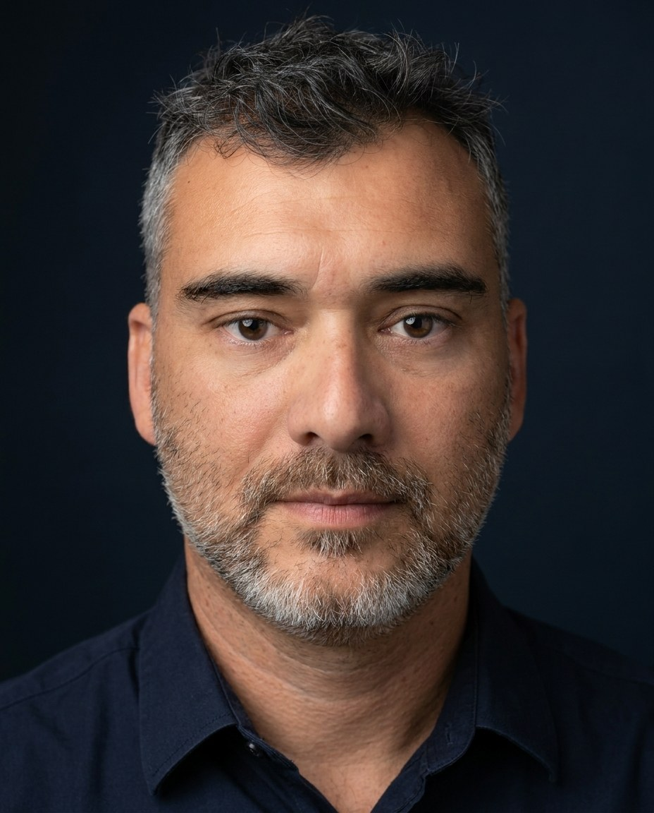
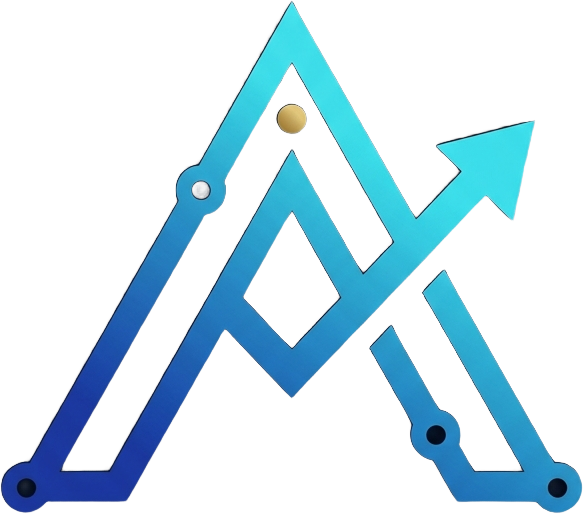

  

  # Felipe Andrade

  **Founder of Andrade Innovations Solutions · Builder of my own digital products**
   
  **Fundador da Andrade Innovations Solutions · Criador de produtos digitais próprios**

  
  

  🇺🇸 <a href="#-about">English</a> · 🇧🇷 <a href="#-sobre">Português</a>

## 🧰 Tech stack

  
  
  
  
  
  
  
  
  
  

---

## 👋 About

Hi, I'm **Felipe** — entrepreneur and builder of digital products.

Brazilian based in the United States, self-taught and passionate about technology. Through **Andrade Innovations Solutions** I run the full lifecycle of my own products: from idea and code to store launch, operation, sales and marketing. **I don't do client work — I build, operate and grow products of my own.**

🔭 **Now:** growing my three products — Brasileiros FL, Trainer Pro Gym and GospelQuiz.

### 🚀 Featured products

**🌴 [Brasileiros FL](https://brasileiros-fl.vercel.app)**
A platform connecting the Brazilian community in Florida to trusted professionals and businesses — listings, reviews and subscriptions.
`Next.js` · `Supabase` · `Stripe` · `Vercel`

**💪 [Trainer Pro Gym](https://apps.apple.com/us/app/trainer-pro-gym/id6765483812)** · ★ 5.0 on the App Store
Gym training app in 3 languages with subscription plans.
`React Native` · `Expo` · `iOS`

**📖 GospelQuiz** · *coming soon to the App Store*
Bible quiz for iPhone (PT/EN) — 1,000 questions and 6 leagues.
`React Native` · `Expo` · `Supabase`

> 🔗 All in one place at **[andrade-innovations.vercel.app](https://andrade-innovations.vercel.app)**

### 🛠️ What I work with

| Technology | Business & Creative |
|---|---|
| Mobile (iOS) apps and web platforms | Digital marketing and traffic |
| Applied artificial intelligence | Online sales and funnels |
| Infrastructure, networks and systems | E-commerce and USD sales |
| Professional audio (recording & mixing) | Copywriting, offers and AI-assisted content |

### 📫 Contact

🌐 **Site & support:** [andrade-innovations.vercel.app](https://andrade-innovations.vercel.app)

⬆ Ler em <a href="#-sobre">Português</a>

---

## 👋 Sobre

Olá, eu sou o **Felipe** — empreendedor e criador de produtos digitais.

Brasileiro radicado nos Estados Unidos, autodidata e apaixonado por tecnologia. Pela **Andrade Innovations Solutions** conduzo o ciclo completo dos meus próprios produtos: da ideia e do código ao lançamento nas lojas, à operação, venda e divulgação. **Não presto serviços a terceiros — construo, opero e faço crescer produtos próprios.**

🔭 **Agora:** fazendo crescer meus três produtos — Brasileiros FL, Trainer Pro Gym e GospelQuiz.

### 🚀 Produtos em destaque

**🌴 [Brasileiros FL](https://brasileiros-fl.vercel.app)**
Plataforma que conecta a comunidade brasileira da Flórida a profissionais e empresas de confiança — anúncios, avaliações e assinaturas.
`Next.js` · `Supabase` · `Stripe` · `Vercel`

**💪 [Trainer Pro Gym](https://apps.apple.com/us/app/trainer-pro-gym/id6765483812)** · ★ 5,0 na App Store
Aplicativo de treino de academia, em 3 idiomas, com planos por assinatura.
`React Native` · `Expo` · `iOS`

**📖 GospelQuiz** · *em breve na App Store*
Quiz bíblico para iPhone (PT/EN) — 1.000 perguntas e 6 ligas.
`React Native` · `Expo` · `Supabase`

> 🔗 Todos reunidos em **[andrade-innovations.vercel.app](https://andrade-innovations.vercel.app)**

### 🛠️ Áreas de atuação

| Tecnologia | Negócios & Criação |
|---|---|
| Aplicativos mobile (iOS) e plataformas web | Marketing digital e tráfego |
| Inteligência artificial aplicada | Vendas online e funis de venda |
| Infraestrutura, redes e sistemas | E-commerce e vendas em dólar |
| Áudio profissional (gravação e mixagem) | Copywriting, ofertas e conteúdo com IA |

### 📫 Contato

🌐 **Site & suporte:** [andrade-innovations.vercel.app](https://andrade-innovations.vercel.app)

⬆ Read in <a href="#-about">English</a>

---

  
   
  <strong>Andrade Innovations Solutions</strong> · Florida, USA

